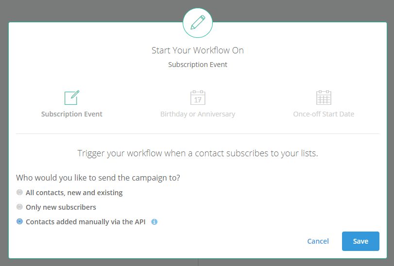
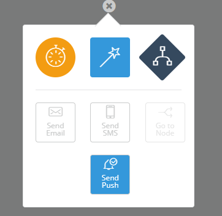

# How to set up transactional Push Notifications
Transactional Push Notifications allow you to send individual Push Messages out to people instead of sending out a bulk message to a group of people. For example: Sending a push notification to someone to notify them that their invoice is due.

**Note: We suggest you are comfortable with sending a bulk Push Notification before this process, because it requires that the SDK is set up correctly.**

## Prerequisites
- You need to have installed and set up our SDK correctly. 
- You will need to be familiar with the our API. See [Getting started with our API](http://help.senderguide.com/api-documentation/getting-started-with-our-api/).
- You need to be familiar with how Workflows work. See [Getting started with Workflows](http://help.senderguide.com/resources/guide-books/getting-started-with-workflows/)

## Setting up the Workflow
When setting up the workflow, be sure to select the list linked to your Push Project during setup. Once you're on the Workflow Builder step, be sure that your Workflow has a Start Action of "Subscription Event - Contacts added only via the API":

Once you've saved, and you have made sure that the list you selected on the previous step is the one you set up in the Push Projects, you should have the option to add an action node of type "Send Push Notification":

Once you've created you Push Message, and published the Workflow, contacts can only enter this workflow via the API Method. This page explains how you can use the API to add contacts to this Workflow: http://help.senderguide.com/api-documentation/components/add-contacts-to-workflow/
